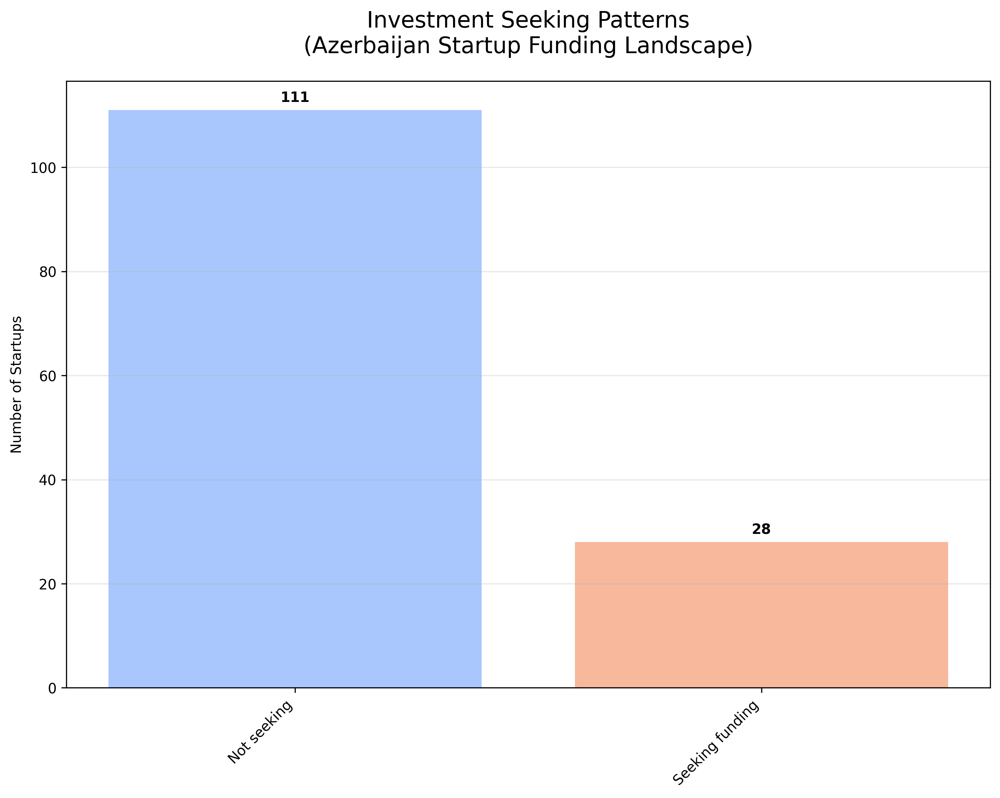
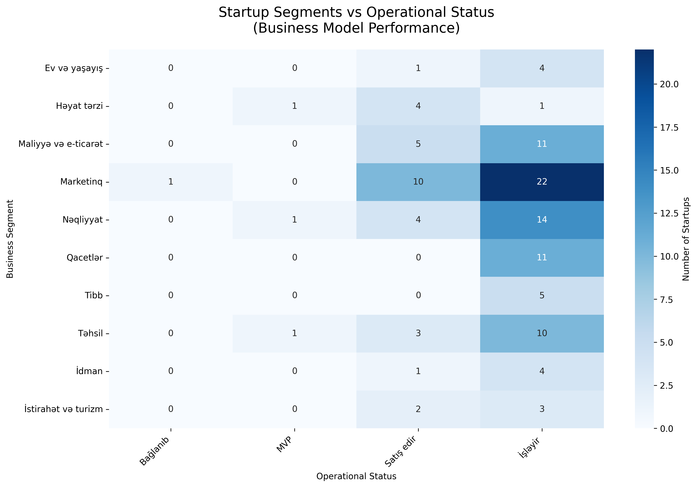

# Startup Azerbaijan Data Analysis

This project analyzes startup data from startup.az to provide insights into Azerbaijan's startup ecosystem.

## Overview

Analysis of **192 startups** from the startup.az platform, revealing key patterns in business segments, operational status, investment patterns, and digital maturity.

## Charts & Insights

### 1. Business Segment Distribution


**Key Insights:**
- **Marketing dominates** with 17.2% of startups (33 companies), indicating strong focus on digital marketing solutions
- **Transportation sector** shows significant activity (9.9%, 19 startups), reflecting Azerbaijan's logistics and mobility innovation
- **Finance & E-commerce** represents 8.3% (16 startups), showing emerging fintech landscape
- **Education technology** comprises 7.3% (14 startups), highlighting edtech growth
- **27.6% have unspecified segments**, suggesting many early-stage startups are still defining their market focus

### 2. Startup Status Distribution


**Key Insights:**
- **50.5% are actively operating** (97 startups), showing a healthy ecosystem with functioning businesses
- **19.8% are actively selling** (38 startups), indicating commercial traction and revenue generation
- **Only 1.6% are in MVP stage** (3 startups), suggesting most move quickly to market or operation phase
- **Low failure rate** with only 0.5% (1 startup) reported as closed
- **27.6% have unknown status**, indicating need for better ecosystem tracking

### 3. Investment Seeking Patterns


**Key Insights:**
- **85.4% are not actively seeking investment** (164 startups), suggesting either self-funded growth or satisfaction with current funding
- **Only 14.6% actively seek investment** (28 startups), indicating a conservative approach to external funding
- **Most sought amounts are modest**: majority seeking up to 25-50k AZN, showing focus on lean startup methodology
- **Low investment appetite** may indicate either strong bootstrapping culture or limited venture capital ecosystem

### 4. Segment vs Status Analysis


**Key Insights:**
- **Marketing startups show highest operational success rate**, with most being either operational or selling
- **Transportation startups demonstrate commercial viability** with good distribution between operational and selling status
- **Education sector shows strong operational focus** with most startups in active operation phase
- **Finance & E-commerce shows mixed maturity levels**, indicating varying business model complexity
- **Unknown segment startups mostly operational**, suggesting focus on execution over segment definition

### 5. Team Size Distribution


**Key Insights:**
- **Most teams are small and lean**, typically 2-11 members
- **Peak team size is 2-3 people**, indicating strong founder-led culture
- **Very few large teams**, suggesting either early-stage nature or preference for lean operations
- **Scalability focus** appears secondary to core product development and market validation

## Digital Maturity Assessment

- **58.9% have websites** - Good digital presence foundation
- **51.0% have email contacts** - Moderate accessibility for stakeholders
- **59.9% have startup certificates** - Strong formal registration and legitimacy

## Ecosystem Recommendations

1. **Strengthen segment definition** for the 27.6% of startups with unclear business focus
2. **Develop investment readiness programs** to increase the low 14.6% seeking investment
3. **Create sector-specific accelerators** for top segments (Marketing, Transportation, Fintech)
4. **Improve ecosystem tracking** to reduce unknown status startups
5. **Build digital infrastructure support** to increase website and contact accessibility

## Technical Setup

```bash
pip install requests beautifulsoup4 pandas openpyxl lxml tqdm matplotlib seaborn numpy
